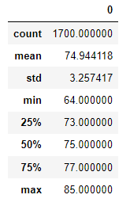

# Module 9 Challenge: Surfs Up

## Overview of the Analysis
W. Avy is considering opening a surf shop that also sells ice cream on the island of Oahu and would like to know if the business is sustainable over the entire year. He has requested temperature data for the months of June and December to get a sampling of the temperature at the height of summer and winter. At his request, I have compiled statistical data for June and December temperatures for the period January 1, 2010 through August 3, 2017.

## Results:
The statistical summaries for June and December are shown below in Figures 1 and 2.

### Figure 1: June Temperature Summary Statistics

### Figure 2: December Temperature Summary Statistics

Based on the summarized temperature data for June and December:
* The mean June temperature is about 4 degrees warmer than the December mean temperature
* The warmest days are very similar between June and December (85 vs 83 degrees respectively)
* The lowest temperatures recorded in December are only slightly cooler than in June (56 vs 64 degrees) 

## Summary
Overall, the temperatures for June and December are remarkably similar. There is no notable tendency for higher or lower temperatures depending on the month. Given than many of W. Avy's clients will be vacationing from cooler climates in the winter, the slight cooling should not dissuade them from indulging in ice cream. Those wishing to surf, both locals and visitors alike, will find the better surf in the winter months, further offsetting any impact of lower temperatures in December. My recommendation to W. Avy is to move forward with a year-round surf / ice cream shop.

## Additional Weather Data
In addition to the request for temperature data, I have compiled precipitation data for June and December, because who wants to surf or eat ice cream on the beach in the middle of a rain storm?

### Figure 3: June Precipitation

### Figure 4: December Precipitation

Based on the summarized precipitation data for June and December:
* There is slightly more rain on average in December than in June
* The median amount of rain on the majority of days is negligible, indicating that at last half of the days are nearly completely dry in both June and December.
* The rainiest of days are in December.

## Revised Summary
Given that there is very little difference in the amount of precipitation between June and December, I make no revisions in my recommendation to move forward with the year-round surf / ice cream shop. Just put up an awning for those particularly rainy days in December and you'll keep your customers happy!

